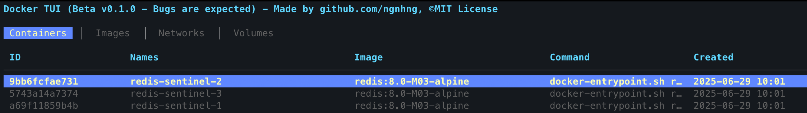

# Docker Status TUI

A K9s-inspired terminal user interface (TUI) for Docker management.



## Installation

### As a Docker CLI Plugin

1. Build the plugin:

   ```bash
   make build
   ```

2. Install as a Docker CLI plugin:

   ```bash
   make install
   ```

   or

   ```bash
   mkdir -p ~/.docker/cli-plugins
   cp docker-status ~/.docker/cli-plugins/
   chmod +x ~/.docker/cli-plugins/docker-status
   ```

   or create a symlink to your preferred location using

   ```bash
   ln -sf $(your_location)/docker-status ~/.docker/cli-plugins/docker-status
   ```

### Standalone Usage

You can also run it directly:

```bash
./docker-status status
```

## Contributing

Contributions are welcome! Please:

1. Fork the repository
2. Create a feature branch
3. Make your changes
4. Add tests if applicable
5. Submit a pull request

## Acknowledgments

- Inspired by [K9s](https://k9scli.io/) for Kubernetes
- Built with [Bubble Tea](https://github.com/charmbracelet/bubbletea) TUI framework
- Uses [Docker Engine API](https://docs.docker.com/engine/api/) for Docker operations
